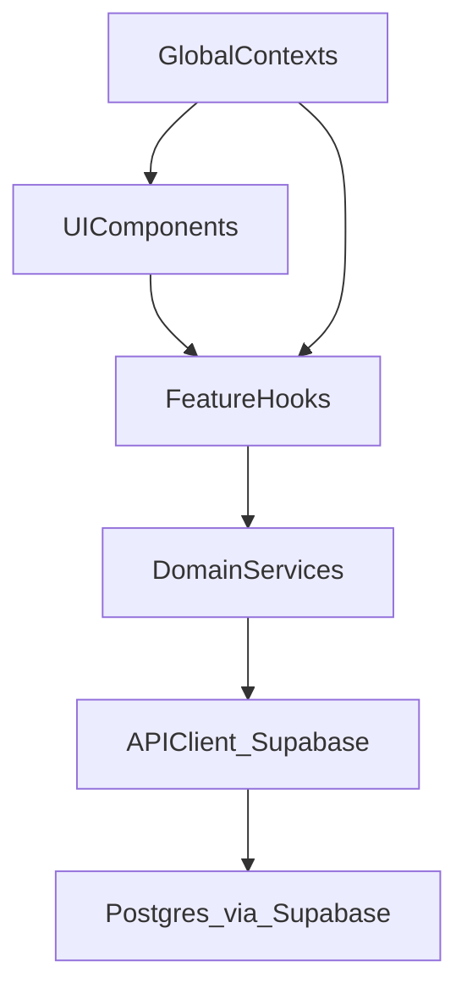

## Frontend Architecture Overview

This document defines the agreed layering and responsibilities for the Round Robin Notes SPA. It complements `CLAUDE.md` by describing **how** pieces fit together at code level.

### Layering Model

At a high level, the app is structured into five layers:

1. **UI Components**
2. **Feature Hooks**
3. **Domain Services & Mappers**
4. **API & Integrations**
5. **Global Contexts & Providers**

These layers are composed as follows:

#### 1. UI Components

- **Location**:
  - `src/components/dashboard/` – desktop dashboard and workspace.
  - `src/components/mobile/` – mobile tabbed experience and patient detail.
  - `src/components/phrases/` – clinical phrases management.
  - `src/components/print/` – print/export surfaces.
  - `src/components/ui/` – shadcn/ui primitives (buttons, inputs, dialogs, etc.).
- **Responsibilities**:
  - Present data passed via props and context.
  - Own *local* UI state only (e.g. which tab is open, which dialog is visible).
  - Call callback props provided by feature hooks/contexts for mutations.
- **Non-responsibilities**:
  - No direct Supabase calls.
  - No global data fetching or caching logic (React Query stays inside hooks/services).

#### 2. Feature Hooks

- **Location**:
  - `src/hooks/patients/` (composed by `src/hooks/usePatients.ts`).
  - `src/hooks/useAllPatientTodos.ts`, `src/hooks/usePatientFilter.ts`, `src/hooks/useAutotexts.ts`, etc.
- **Responsibilities**:
  - Orchestrate **React Query** calls and derive data for specific features.
  - Expose a cohesive API for components: e.g. `usePatients` returns `patients`, `loading`, and CRUD actions.
  - Coordinate multiple services/API calls when necessary (e.g. importing + mapping patients).
- **Non-responsibilities**:
  - Rendering JSX (other than tiny portals if absolutely needed).
  - Direct DOM manipulation (beyond normal React hooks).

#### 3. Domain Services & Mappers

- **Location**:
  - `src/services/` – e.g. `patientService.ts`.
  - `src/lib/mappers/` – e.g. `patientMapper.ts`.
- **Responsibilities**:
  - Convert between database records and domain types (`Patient`, `PatientSystems`, `PatientMedications`).
  - Implement pure or side-effect-minimal business logic:
    - Default value helpers (e.g. `defaultSystemsValue`, `defaultMedicationsValue`).
    - Utility functions like `getNextPatientCounter`, `shouldTrackTimestamp`.
  - Provide reusable transformation utilities used by hooks and components.
- **Non-responsibilities**:
  - Managing UI state or React Query.
  - Importing React or tying logic to routing.

#### 4. API & Integrations

- **Location**:
  - `src/api/` – generic API client helpers, retry/dedup logic.
  - `src/integrations/supabase/` – Supabase client and generated types.
  - `src/integrations/fhir/` – FHIR client helpers used in `FHIRCallback`.
  - Edge functions in `supabase/functions/` for AI and text processing.
- **Responsibilities**:
  - Encapsulate network calls (Supabase RPC, table queries, edge functions, FHIR APIs).
  - Apply cross-cutting concerns: retries, timeouts, structured error shapes.
  - Keep transport details out of UI and feature hooks.
- **Non-responsibilities**:
  - Complex domain mapping (delegate to services/mappers).
  - Any React or component concerns.

#### 5. Global Contexts & Providers

- **Location**:
  - `src/contexts/` – `SettingsContext`, `IBCCContext`, `ClinicalGuidelinesContext`, `ChangeTrackingContext`, `DashboardContext`, etc.
  - Composition root: `src/App.tsx`.
- **Responsibilities**:
  - Manage **app-wide state and behavior**:
    - Auth/session (`useAuth` provider).
    - Settings & preferences.
    - IBCC/guidelines selection and content.
    - Change-tracking configuration.
    - Dashboard-wide state (selected patient, filters, callbacks).
  - Provide shared callbacks used across unrelated parts of the UI (e.g. `onAddPatient`, `onSignOut`).
- **Non-responsibilities**:
  - Low-level data mapping from DB records.
  - One-off, local UI state (keep that in components).

### Example: Patients Flow End-to-End

1. **Route**: `/` → `Index` (`src/pages/Index.tsx`).
2. `IndexContent` sets up:
   - `DashboardProvider` (global dashboard context).
   - Hooks: `usePatients`, `useAllPatientTodos`, `usePatientFilter`, `useCloudAutotexts`, `useCloudDictionary`, `useIBCCState`, `useSettings`.
3. `usePatients` (`src/hooks/patients/index.ts`):
   - Uses `usePatientFetch` for loading and caching via React Query.
   - Uses `usePatientMutations` for CRUD and collapse/clear actions.
   - Uses `usePatientImport` for bulk/structured imports.
4. `usePatientFetch` and `usePatientMutations` call into:
   - Supabase client helpers in `src/integrations/supabase/` and
   - Mapping/helpers in `src/services/patientService.ts` and `src/lib/mappers/patientMapper.ts`.
5. UI components (`DesktopDashboard`, `MobileDashboard`, `VirtualizedPatientList`, `MobilePatientDetail`) consume:
   - Data (`patients`, `filteredPatients`, todos, settings) from `DashboardContext` and hooks.
   - Callbacks (`onUpdatePatient`, `onRemovePatient`, `onDuplicatePatient`, etc.) which route back through `usePatients`.

### Practical Guidelines for New Code

- **Adding a new feature around patients**:
  - Put domain helpers in `src/services/` or `src/lib/mappers/`.
  - Expose them via a focused hook in `src/hooks/` (or extend the `patients` sub-hooks).
  - Consume that hook from components in `src/components/dashboard/` or `src/components/mobile/`.

- **Adding a new external integration**:
  - Add the client/wrapper under `src/integrations/` or `src/api/`.
  - Keep network details isolated; return typed data structures to services/hooks.

- **Adding cross-cutting behavior** (e.g. global settings or tracking):
  - Implement a new context in `src/contexts/` if truly global.
  - Wire it into the provider tree in `src/App.tsx`.
  - Access it from hooks/components via the exported `useX` hook.

