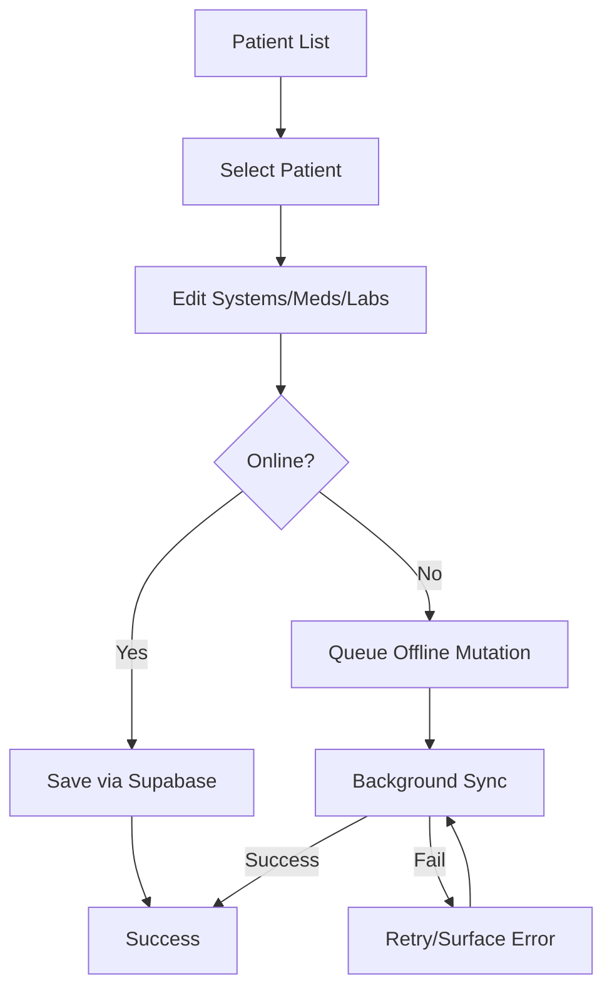
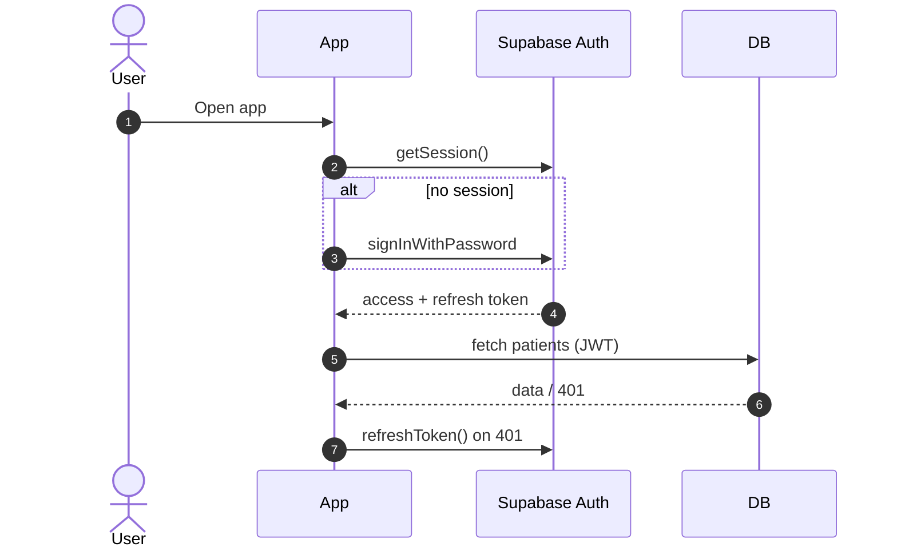
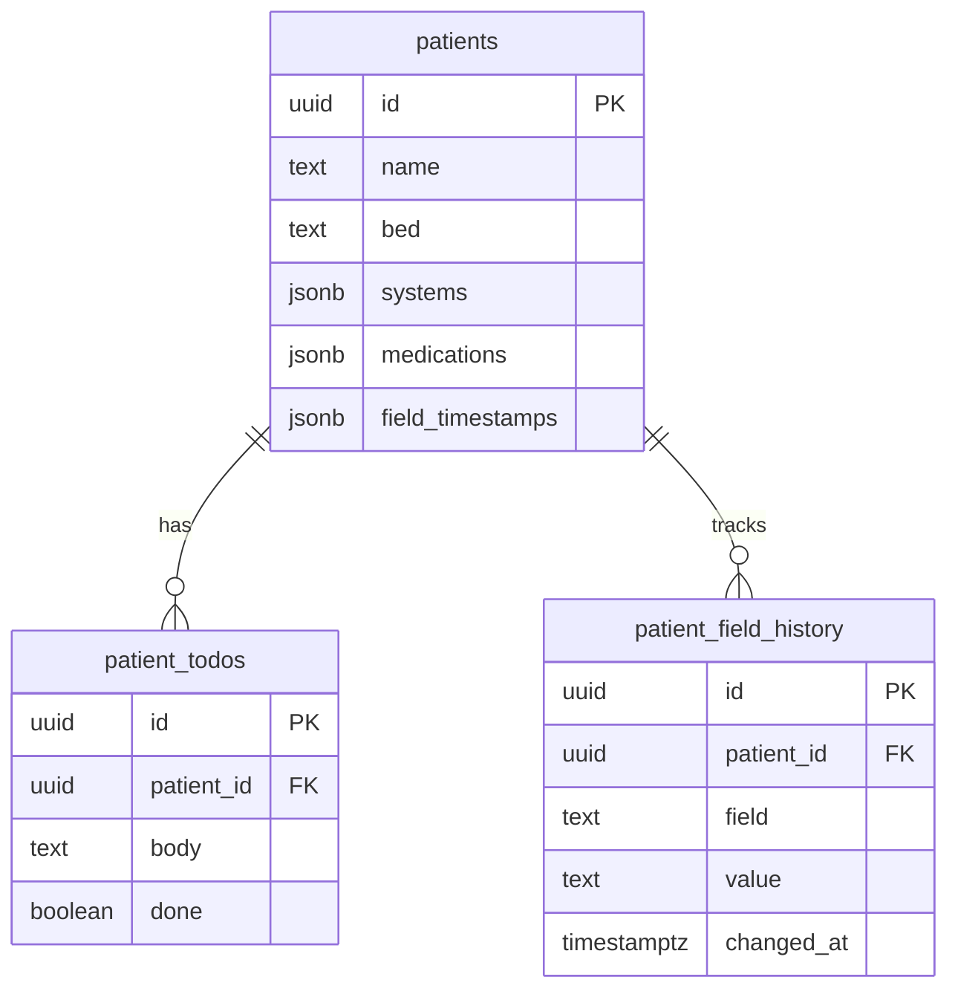
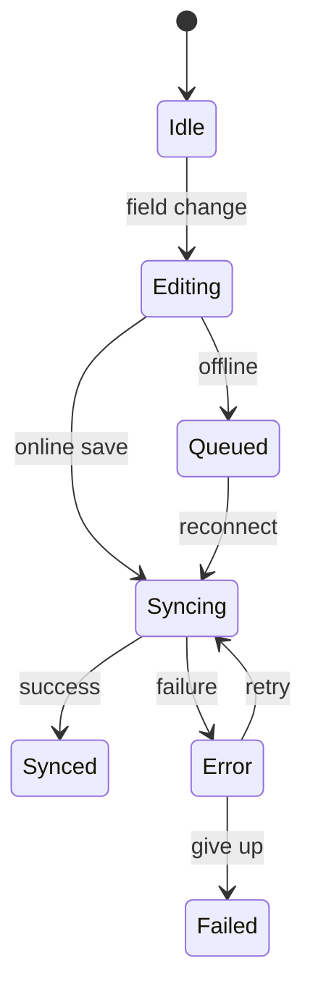
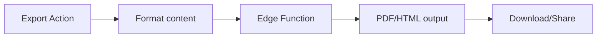

## Architecture Diagrams (Mermaid)

These Mermaid diagrams illustrate core flows in Round Robin Notes. View directly in GitHub or any Mermaid-enabled markdown renderer.

### Rendering notes
- Diagrams are in fenced ```mermaid code blocks.
- For local preview, use a Mermaid-enabled markdown viewer or open the in-app Help page (/help) which renders them client-side.

### Rounding flow


### Auth and request lifecycle


### Patient data ERD (trimmed)


### Offline/editor state machine


### Export pipeline

